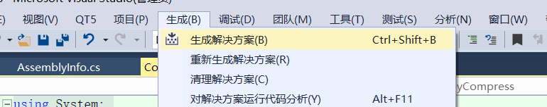
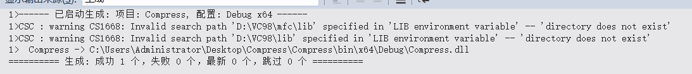
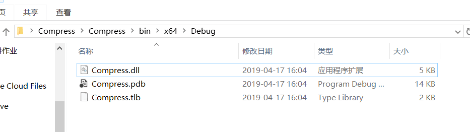
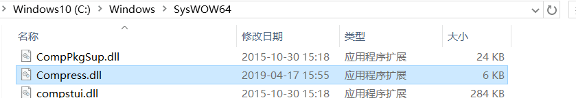
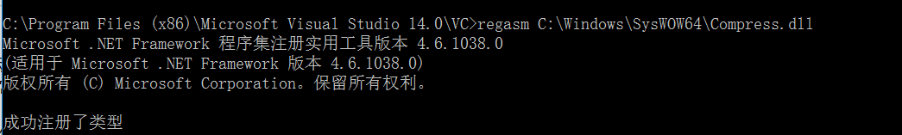
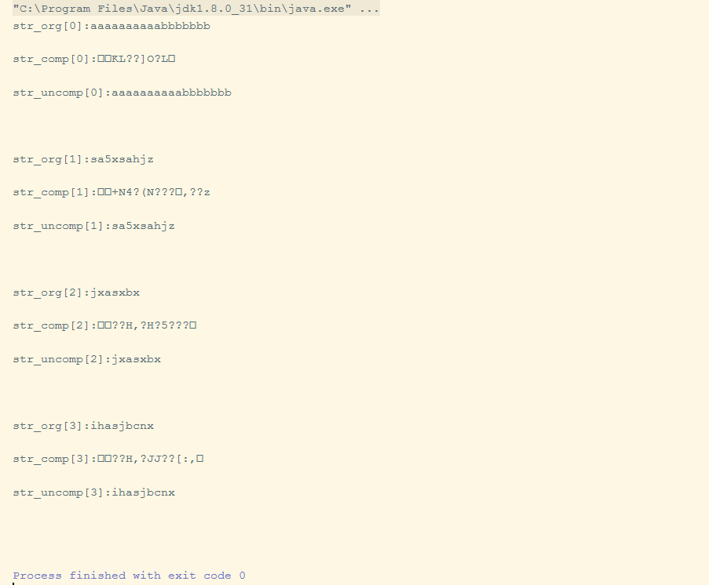
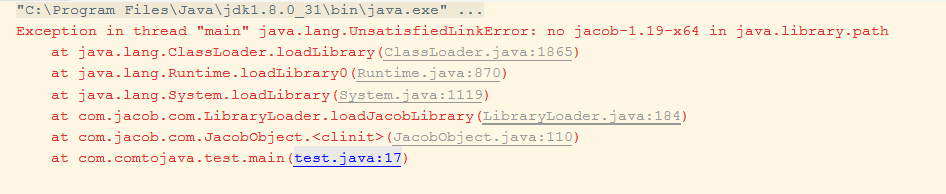
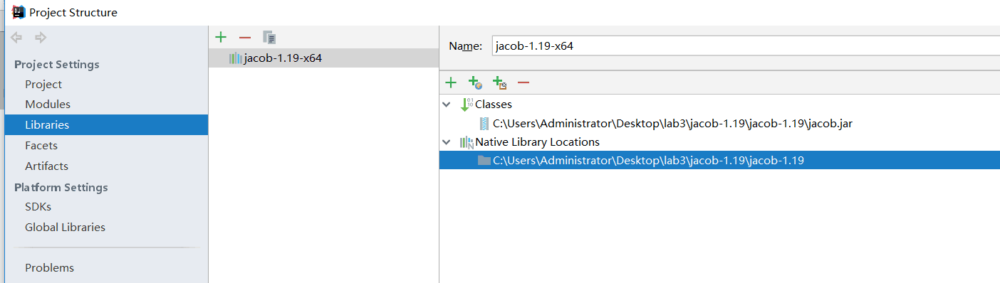
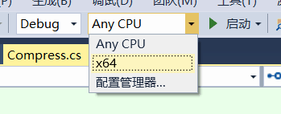

<link href="https://cdn.bootcss.com/highlight.js/9.15.5/styles/a11y-light.min.css" rel="stylesheet">

#COM组件和调用 
##**一.实验目的**
构建一个com组件，该组件可以对一个字符串数组进行压缩和解压缩（压缩和解压算法自己定义，或者调用其他的库）
##**二.实验环境**
IDE：Idea Intellij、Visual Studio2015

Project SDK：java jdk 1.8

##**三.实验过程**
###1.利用c#生成一个com组件：
创建项目过程见：https://www.cnblogs.com/591028872-allan/p/7651771.html
####源码：Compress.cs

​      

      using System;
      
      using System.Collections.Generic;
      
      using System.Linq;
      
      using System.Text;
      
     using System.Runtime.InteropServices;
    
    namespace Compress
    {
    [Guid("FC5F8F1E-1823-4E0D-BC98-566DA8E23C7C")]
    public interface IMyCompress
    {
    void Init();
    void Dispose();
    string Zip(string value);//压缩
    string UnZip(string value);//解压
    }
    
    [ClassInterface(ClassInterfaceType.None)]
    [Guid("A333D206-8295-4D3C-93BC-BE4CDF5031CC")]
    [ProgId("Compress.Application")]
    public class Compress : IMyCompress
    {
    public void Init()
    {
    
    }
    public void Dispose()
    {
    
    }
    public string Zip(string value)
    {
    //Transform string into byte[] 
    byte[] byteArray = new byte[value.Length];
    int indexBA = 0;
    foreach (char item in value.ToCharArray())
    {
    byteArray[indexBA++] = (byte)item;
    }
    //Prepare for compress
    System.IO.MemoryStream ms = new System.IO.MemoryStream();
    System.IO.Compression.GZipStream sw = new System.IO.Compression.GZipStream(ms,
       System.IO.Compression.CompressionMode.Compress);
    //Compress
    sw.Write(byteArray, 0, byteArray.Length);
    //Close, DO NOT FLUSH cause bytes will go missing...
    sw.Close();
    //Transform byte[] zip data to string
    byteArray = ms.ToArray();
    System.Text.StringBuilder sB = new System.Text.StringBuilder(byteArray.Length);
    foreach (byte item in byteArray)
    {
    sB.Append((char)item);
    }
    ms.Close();
    sw.Dispose();
    ms.Dispose();
    return sB.ToString();
    }
    public string UnZip(string value)
    {
    //Transform string into byte[]
    byte[] byteArray = new byte[value.Length];
    int indexBA = 0;
    foreach (char item in value.ToCharArray())
    {
    byteArray[indexBA++] = (byte)item;
    }
    //Prepare for decompress
    System.IO.MemoryStream ms = new System.IO.MemoryStream(byteArray);
    System.IO.Compression.GZipStream sr = new System.IO.Compression.GZipStream(ms, System.IO.Compression.CompressionMode.Decompress);
    //Reset variable to collect uncompressed result
    byteArray = new byte[byteArray.Length];
    //Decompress
    int rByte = sr.Read(byteArray, 0, byteArray.Length);
    //Transform byte[] unzip data to string
    System.Text.StringBuilder sB = new System.Text.StringBuilder(rByte);
    //Read the number of bytes GZipStream red and do not a for each bytes in
    //resultByteArray;
    for (int i = 0; i < rByte; i++)
    {
    sB.Append((char)byteArray[i]);
    }
    sr.Close();
    ms.Close();
    sr.Dispose();
    ms.Dispose();
    return sB.ToString();
    }
    
    }
    }

####注册COM组件至系统：
生成解决方案：

将目标路径的Compress.dll复制到C:\Windows\SysWOW64路径下（64位系统），32位系统复制到C:\Windows\System32 下。

在VS自带的命令窗口下输入如下命令进行注册：

regasm C:\Windows\SysWOW64\Compress.dll（64位）

regasm C:\Windows\System32\Compress.dll（32位）

注册成功。

###2.利用java调用组件：
####测试代码Test.java:

        public static void main(String[] args) {    
            // TODO Auto-generated method stub   
       try{    
            ActiveXComponent dotnetCom = null;
            String str_org[]={"aaaaaaaaaabbbbbbb","sa5xsahjz","jxasxbx","ihasjbcnx"};
            String str_comp[]=new String[str_org.length];
            String str_uncomp[]=new String[str_org.length];
            dotnetCom = new ActiveXComponent("Compress.Application");     //需要调用的C#代码中的命名空间名和类名。
    
            for(int i=0;i<str_org.length;i++) {
                Variant var = Dispatch.call(dotnetCom, "Zip", str_org[i]);   //需要调用的方法名和参数值
                str_comp[i] = var.toString();  //返回压缩后的字符串
                Variant var2 = Dispatch.call(dotnetCom, "UnZip", str_comp[i]);   //需要调用的方法名和参数值
                str_uncomp[i] = var2.toString();  //返回解压后的字符串
                System.out.println("str_org["+i +"]:"+ str_org[i] + "\n");  //输出原始字符串。
                System.out.println("str_comp["+i +"]:"+ str_comp[i] + "\n");  //输出压缩后的字符串。
                System.out.println("str_uncomp["+i +"]:" + str_uncomp[i] + "\n");  //输出解压后的字符串。检查结果是否正确。
                System.out.println("\n");
            }
        } catch (Exception ex) {
                ex.printStackTrace();    
            }    
    }      

运行结果：

###3.实验中出现的问题
####①.启动测试用例时出现如下错误：

解决方法：jacob-1.19-x64.dll和jacob-1.19.jar**都要**添加到library path下。

####②.启动测试用例时出现如下错误：

    com.jacob.com.ComFailException: Can't co-create object

解决方法：在VB.NET中编译选择的平台如果是Any CPU，那么久意味着生成的dll文件是32位的。如果出现以上错误，应该选择X64的平台，即可解决。

