<link href="https://cdn.bootcss.com/highlight.js/9.15.5/styles/a11y-light.min.css" rel="stylesheet">

#wildfly+EJB调用
##**一.实验目的**
建立无状态的Java Bean，实现以下功能：

验证操作用户（录入人员）的登陆的信息是否正确；

把校友的数据插入到数据库的中；应包含校友的所有信息；

对校友目录进行的检索、修改、删除、统计等功能。
##**二.实验环境**
IDE：Idea Intellij

Server ：wildfly-16.0.0.Final

Application Server：JBoss 8.0.0 Final

##**三.实验过程**
###1.service包结构
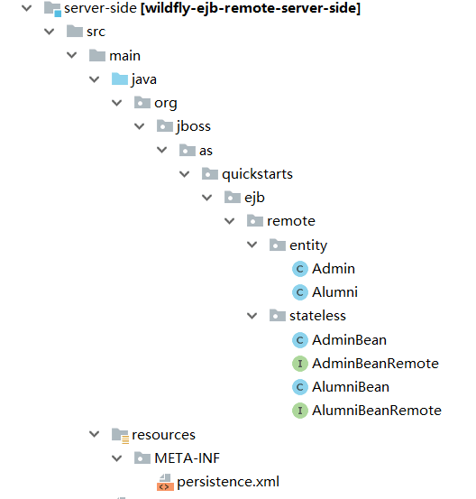
###2. service源码

####实体类：Admin.java
    package org.jboss.as.quickstarts.ejb.remote.entity;
    import javax.persistence.GeneratedValue;
    import javax.persistence.GenerationType;
    import javax.persistence.Id;
    import javax.persistence.Entity;
    import javax.persistence.Table;
    
    
    import javax.persistence.Column;
    import java.io.Serializable;
    import java.math.BigInteger;
    
    @Entity  //表明这是一个实体Bean
    @Table (name = "admin" ) //和数据库表admin 建立映射
    public class Admin implements Serializable{
    @Id // 表明是该实体的id
    @GeneratedValue(strategy = GenerationType.IDENTITY) //id生成策略
    @Column(name = "id" )//对应data表id字段
    private BigInteger id; // 数据编号
    
    @Column(name = "account" ) // 对应data表account字段
    private String account; // 用户账号
    
    public BigInteger getId() {
    return id;
    }
    
    public void setId(BigInteger id) {
    this.id = id;
    }
    
    public String getAccount() {
    return account;
    }
    
    public void setAccount(String account) {
    this.account = account;
    }
    
    public String getPassword() {
    return password;
    }
    
    public Admin() {
    }
    
    public void setPassword(String password) {
    this.password = password;
    }
    
    public Admin(String account, String password) {
    this.account = account;
    this.password = password;
    }
    
    @Column(name = "password" ) // 对应data表password字段
    private String password; // 用户密码  
    
    }
####实体类：Alumni.java
    package org.jboss.as.quickstarts.ejb.remote.entity;
    
    import javax.persistence.*;
    import java.io.Serializable;
    import java.math.BigInteger;
    import java.time.Year;
    import java.util.Date;
    
    @Entity  //表明这是一个实体Bean
    @Table(name = "alumni" ) //和数据库表alumin 建立映射
    public class Alumni implements Serializable {
    @Id // 表明是该实体的id
    @GeneratedValue(strategy = GenerationType.IDENTITY) //id生成策略
    @Column(name = "id" )//对应data表id字段
    private BigInteger id; // 数据编号
    
    @Column(name = "name" )
    private String name;
    
    @Column(name = "sex" )
    private Integer sex;
    
    @Column(name="birthday")
    private String date;
    
    @Column(name="enrollment_year")
    private String year;
    
    @Column(name="work_area")
    private String work_area;
    
    @Column(name="work_address")
    private String work_address;
    
    @Column(name="position")
    private String position;
    
    @Column(name="phone")
    private String phone;
    
    public Alumni(String name, Integer sex, String date, String year, String work_area, String work_address, String position, String phone, String email, String weixin) {
    this.name = name;
    this.sex = sex;
    this.date = date;
    this.year = year;
    this.work_area = work_area;
    this.work_address = work_address;
    this.position = position;
    this.phone = phone;
    this.email = email;
    this.weixin = weixin;
    }
    
    @Column(name="email")
    
    private String email;
    
    @Column(name="weixin")
    private String weixin;
    
    public Alumni() {
    }
    
    public BigInteger getId() {
    return id;
    }
    
    public void setId(BigInteger id) {
    this.id = id;
    }
    
    public String getName() {
    return name;
    }
    
    public void setName(String name) {
    this.name = name;
    }
    
    public Integer getSex() {
    return sex;
    }
    
    public void setSex(Integer sex) {
    this.sex = sex;
    }
    
    public String getDate() {
    return date;
    }
    
    public void setDate(String date) {
    this.date = date;
    }
    
    public String getYear() {
    return year;
    }
    
    public void setYear(String year) {
    this.year = year;
    }
    
    public String getWork_area() {
    return work_area;
    }
    
    public void setWork_area(String work_area) {
    this.work_area = work_area;
    }
    
    public String getWork_address() {
    return work_address;
    }
    
    public void setWork_address(String work_address) {
    this.work_address = work_address;
    }
    
    public String getPosition() {
    return position;
    }
    
    public void setPosition(String position) {
    this.position = position;
    }
    
    public String getPhone() {
    return phone;
    }
    
    public void setPhone(String phone) {
    this.phone = phone;
    }
    
    public String getEmail() {
    return email;
    }
    
    public void setEmail(String email) {
    this.email = email;
    }
    
    public String getWeixin() {
    return weixin;
    }
    
    public void setWeixin(String weixin) {
    this.weixin = weixin;
    }
    }

####Bean接口：AdminBeanRemote.interface
    
    package org.jboss.as.quickstarts.ejb.remote.stateless;
    
    import org.jboss.as.quickstarts.ejb.remote.entity.Admin;
    import org.jboss.as.quickstarts.ejb.remote.entity.Alumni;
    
    import javax.ejb.Remote;
    import java.math.BigInteger;
    import java.util.List;
    
    @Remote
    public interface AdminBeanRemote {
    
    void createAdmin(Admin admin); //创建管理员
       boolean loginAdmin(Admin admin); //查询并获取管理员
    
    }
####Bean接口：AlumniBeanRemote.interface
    package org.jboss.as.quickstarts.ejb.remote.stateless;
    
    import org.jboss.as.quickstarts.ejb.remote.entity.Alumni;
    
    import javax.ejb.Remote;
    import java.util.List;
    @Remote
    public interface AlumniBeanRemote {
    void createAlumni(Alumni alumni);
    void alterAlumniEmail(String name,String email);
    void deleteAlumni(String name);
    List<Alumni> calculateAlumni();
    Alumni findByName(String name);
    }
    

####建立无状态会话Bean：AdminBean.java
    package org.jboss.as.quickstarts.ejb.remote.stateless;
    
    import org.jboss.as.quickstarts.ejb.remote.entity.Admin;
    
    import javax.ejb.Stateless;
    import javax.persistence.EntityManager;
    import javax.persistence.PersistenceContext;
    import javax.persistence.Query;
    import java.math.BigInteger;
    
    @Stateless
    public class AdminBean implements AdminBeanRemote{
    @PersistenceContext(unitName = "entity")
    private EntityManager manager;
    
    @Override
    public void createAdmin(Admin admin) {
    manager.persist(admin);
    }
    
    
    
    @Override
    public boolean loginAdmin(Admin admin) {
    String sql = "select p.password from Admin p where p.account=:account";
    Query query = manager.createQuery(sql).setParameter("account",admin.getAccount());
       String password=(String)query.getSingleResult();
    if(password.equals(admin.getPassword()))
    {
    return true;
    }
    else {
    return false;
    }
    }
    
    }

####AlumniBean.java：
    package org.jboss.as.quickstarts.ejb.remote.stateless;
    
    import org.jboss.as.quickstarts.ejb.remote.entity.Alumni;
    
    import javax.ejb.Stateless;
    import javax.persistence.EntityManager;
    import javax.persistence.PersistenceContext;
    import javax.persistence.Query;
    import java.util.List;
    
    @Stateless
    public class AlumniBean implements AlumniBeanRemote{
    @PersistenceContext(unitName = "entity")
    private EntityManager manager;
    
    @Override
    public void createAlumni(Alumni alumni) {
    manager.persist(alumni);
    }
    
    @Override
    public void alterAlumniEmail(String name,String email) {
    
    Query query = manager.createQuery("update Alumni p set p.email=:email where p.name=:name");
    query.setParameter("name", name);
    query.setParameter("email", email);
    query.executeUpdate();
    
    
    }
    
    @Override
    public void deleteAlumni(String name) {
    
    Query query1 = manager.createQuery(" delete Alumni p where p.name=:name");
    query1.setParameter("name", name);
    query1.executeUpdate();
    
    }
    
    @Override
    public List<Alumni> calculateAlumni() {
    Query query1 = manager.createQuery("From Alumni as p");
    List<Alumni>alumniList=query1.getResultList();
    return alumniList;
    }
    
    @Override
    public Alumni findByName(String name) {
    String sql="SELECT p FROM Alumni p WHERE p.name=:name";
    Query query = manager.createQuery(sql).setParameter("name",name);
    Alumni alumni=(Alumni)query.getSingleResult();
    return alumni;
    }
    }

###2.配置数据源

####①持久层配置：persistence.xml
    <?xml version="1.0" encoding="UTF-8"?>
    <persistence xmlns="http://java.sun.com/xml/ns/persistence"
     xmlns:xsi="http://www.w3.org/2001/XMLSchema-instance"
     xsi:schemaLocation="http://java.sun.com/xml/ns/persistence
    http://java.sun.com/xml/ns/persistence/persistence_1_0.xsd" version="1.0">
    
    <!-- entity就是EntityManager服务名 -->
    <persistence-unit name="entity" transaction-type="JTA">
    <!-- 注意此处jta-data-source的配置 -->
    <jta-data-source>java:jboss/datasources/MySqlDS</jta-data-source>
    <!-- 以下是hibernate的相关配置，可省略 -->
    <properties>
    <property name="hibernate.dialect" value="org.hibernate.dialect.MySQL5Dialect"/>
    
    <property name="hibernate.connection.characterEncoding" value="UTF-8" />
    </properties>
    </persistence-unit>
    
    </persistence>
**注意该文件必须放在项目目录的/resource/META-INF下

####②在/JBOSS_HOME/modules/下创建文件夹main，并在文件夹下创建module.xml：

    <module xmlns="urn:jboss:module:1.1" name="com.mysql" slot="main">
    <resources>
    <resource-root path="mysql-connector-java-5.1.38.jar"/>
    </resources>
    <dependencies>
    <module name="javax.api"/>
      <module name="javax.transaction.api"/>
    </dependencies>
    </module>

并根据配置内容中mysql-connector-java的版本，将同样版本的jar文件放入该文件夹：

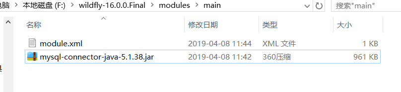

####③修改/JBOSS_HOME/standalone/configuration/standalone.xml中datasource相关部分：
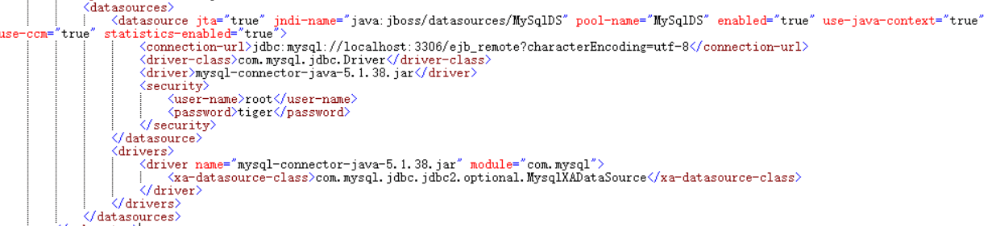

修改默认数据源：

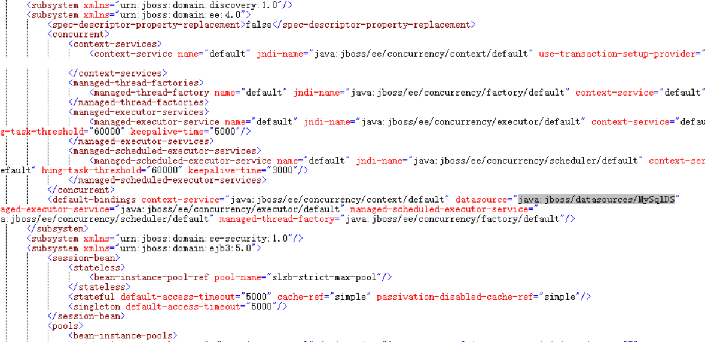

注意此处<jndi-name>需要与persistence.xml中<jta-data-source>一致！
####④双击/JBOSS_HOME/bin/standalone.dat启动wildfly服务，进入http://localhost:9990/查看配置（需要输入用户名及密码登录，若还未注册用户，点击add-user.bat进行用户添加。）

确认服务器中数据源已配置成功

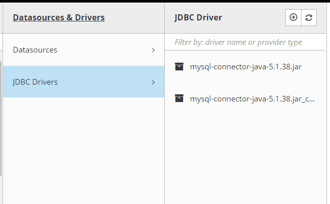

确认jdbc drivers配置成功

###3.建立数据库

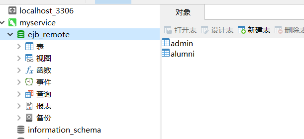
    
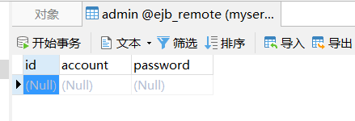
    
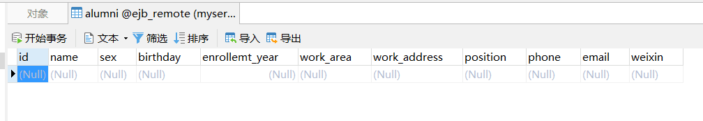

###4.部署服务端：

**方法一：**

打包jar包：

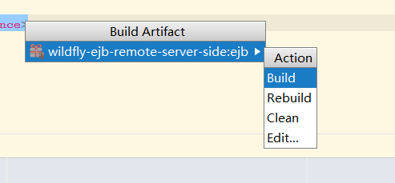

将jar包放入/JBOSS_HOME/standalone/deployments中

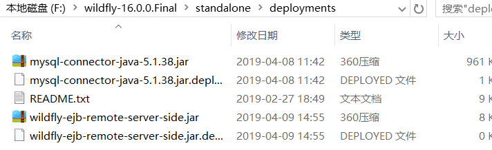

双击standalone.bat启动

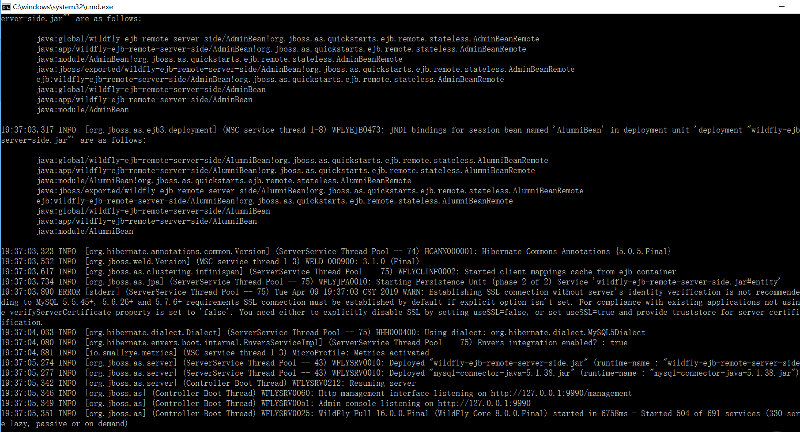

**方法二：**

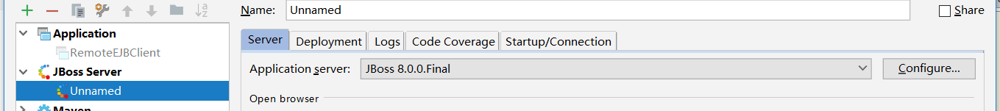

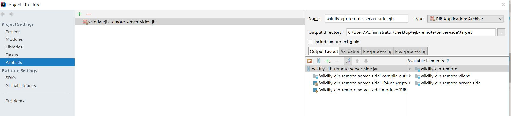

部署成功：

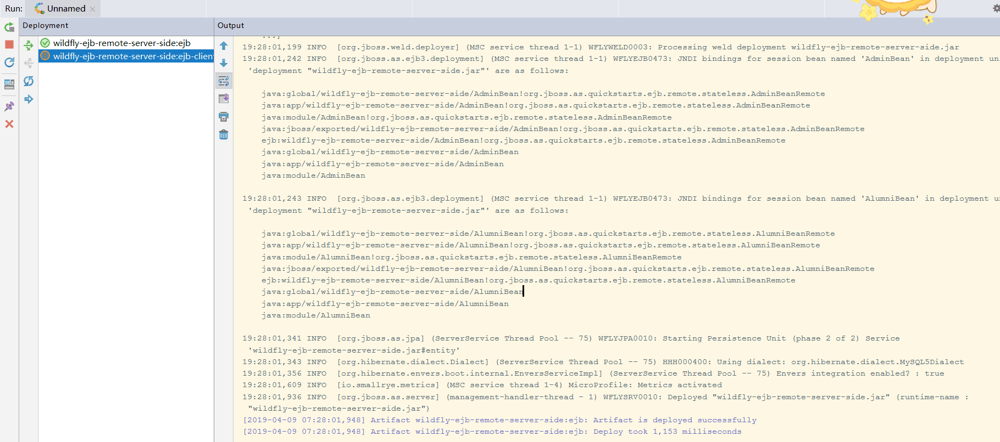

注意此处信息：
    
    
    [org.jboss.as.ejb3.deployment] (MSC service thread 1-8) WFLYEJB0473: JNDI bindings for session bean named 'AdminBean' in deployment unit 'deployment "wildfly-ejb-remote-server-side.jar"' are as follows:
    
    java:global/wildfly-ejb-remote-server-side/AdminBean!org.jboss.as.quickstarts.ejb.remote.stateless.AdminBeanRemote
    java:app/wildfly-ejb-remote-server-side/AdminBean!org.jboss.as.quickstarts.ejb.remote.stateless.AdminBeanRemote
    java:module/AdminBean!org.jboss.as.quickstarts.ejb.remote.stateless.AdminBeanRemote
    java:jboss/exported/wildfly-ejb-remote-server-side/AdminBean!org.jboss.as.quickstarts.ejb.remote.stateless.AdminBeanRemote
    ejb:wildfly-ejb-remote-server-side/AdminBean!org.jboss.as.quickstarts.ejb.remote.stateless.AdminBeanRemote
    java:global/wildfly-ejb-remote-server-side/AdminBean
    java:app/wildfly-ejb-remote-server-side/AdminBean
    java:module/AdminBean
    
    [org.jboss.as.ejb3.deployment] (MSC service thread 1-8) WFLYEJB0473: JNDI bindings for session bean named 'AlumniBean' in deployment unit 'deployment "wildfly-ejb-remote-server-side.jar"' are as follows:
    
    java:global/wildfly-ejb-remote-server-side/AlumniBean!org.jboss.as.quickstarts.ejb.remote.stateless.AlumniBeanRemote
    java:app/wildfly-ejb-remote-server-side/AlumniBean!org.jboss.as.quickstarts.ejb.remote.stateless.AlumniBeanRemote
    java:module/AlumniBean!org.jboss.as.quickstarts.ejb.remote.stateless.AlumniBeanRemote
    java:jboss/exported/wildfly-ejb-remote-server-side/AlumniBean!org.jboss.as.quickstarts.ejb.remote.stateless.AlumniBeanRemote
    ejb:wildfly-ejb-remote-server-side/AlumniBean!org.jboss.as.quickstarts.ejb.remote.stateless.AlumniBeanRemote
    java:global/wildfly-ejb-remote-server-side/AlumniBean
    java:app/wildfly-ejb-remote-server-side/AlumniBean
    java:module/AlumniBean

###5.client源码：
RemoteEJBClient.java:

    package org.jboss.as.quickstarts.ejb.remote.client;
    
    import org.jboss.as.quickstarts.ejb.remote.entity.Admin;
    import org.jboss.as.quickstarts.ejb.remote.entity.Alumni;
    import org.jboss.as.quickstarts.ejb.remote.stateless.AdminBeanRemote;
    import org.jboss.as.quickstarts.ejb.remote.stateless.AlumniBeanRemote;
    
    import javax.naming.Context;
    import javax.naming.InitialContext;
    import javax.naming.NamingException;
    
    import java.math.BigDecimal;
    import java.math.BigInteger;
    import java.sql.Time;
    import java.time.Year;
    import java.util.Date;
    import java.util.Hashtable;
    import java.util.List;
    import java.util.Properties;
    
    /**
     * A sample program which acts a remote client for a EJB deployed on AS7 server. This program shows how to lookup stateful and
     * stateless beans via JNDI and then invoke on them
     *
     * @author Jaikiran Pai
     */
    public class RemoteEJBClient {
    
    public static void main(String[] args) throws Exception {
    
    try {
    Properties props = new Properties();
    props.put(Context.INITIAL_CONTEXT_FACTORY, "org.jboss.naming.remote.client.InitialContextFactory");
    props.put(Context.PROVIDER_URL, "http-remoting://localhost:8080");
    props.put("jboss.naming.client.ejb.context", true);
    
    InitialContext context = new InitialContext(props);
    AdminBeanRemote ubr = (AdminBeanRemote)context.lookup("ejb:/wildfly-ejb-remote-server-side/AdminBean!org.jboss.as.quickstarts.ejb.remote.stateless.AdminBeanRemote");
    AlumniBeanRemote ubr2=(AlumniBeanRemote)context.lookup("ejb:/wildfly-ejb-remote-server-side/AlumniBean!org.jboss.as.quickstarts.ejb.remote.stateless.AlumniBeanRemote");
    
    
    //验证操作用户（录入人员）的登陆
    Admin admin=new Admin();
    admin.setAccount("a");
    admin.setPassword("a");
    boolean login=ubr.loginAdmin(admin);
    if(login==true) {
    System.out.println("login admin:"+admin.getAccount()+" successfully!\n");
    }
    
    //录入校友数据
    Date date=new Date(1998,4,25);
    
    Alumni alumni=new Alumni("zyy",0,"1998-4-25","1998","aaa","sss","ww","15060809856","123@qq.com","4252");
    ubr2.createAlumni(alumni);
    System.out.println("insert an alumni:"+alumni.getName()+" successfully!\n");
    
    //新建管理员
    Admin admin2=new Admin("sd","sd");
    ubr.createAdmin(admin2);
    System.out.println("create admin:"+admin2.getAccount()+" successfully!\n");
    
    //根据姓名查询校友信息
    System.out.println("begin to search for alumni:");
    String name = "zyy";
    
    Alumni resultAlumni=ubr2.findByName(name);
    System.out.println(resultAlumni);
    System.out.println("basic information of "+name+":");
    System.out.println(resultAlumni.getName()+"\n"+resultAlumni.getDate()+"\n"+resultAlumni.getEmail()+"\n"+resultAlumni.getPhone()+"\n");
    
    //根据姓名修改校友信息（仅演示修改邮箱）
    System.out.println("altering alumni info beginning...\n");
    ubr2.alterAlumniEmail(name,"321@qq.com");
    System.out.println("altering alumni info successfully!\n");
    
    //统计所有校友
    List<Alumni>list=ubr2.calculateAlumni();
    System.out.println("number of alumni:"+list.size());
    System.out.println(list+"\n");
    
    //根据姓名删除校友
    System.out.println("deleting alumni beginning...\n");
     ubr2.deleteAlumni(name);
    System.out.println("deleting alumni successfully...\n");
    
    
    
    }
    	catch (Exception ex) {
    ex.printStackTrace();
    }
    
    
    }
    
    }

注意此处代码：
        
    InitialContext context = new InitialContext(props);
    AdminBeanRemote ubr = (AdminBeanRemote)context.lookup("ejb:/wildfly-ejb-remote-server-side/AdminBean!org.jboss.as.quickstarts.ejb.remote.stateless.AdminBeanRemote");
    AlumniBeanRemote ubr2=(AlumniBeanRemote)context.lookup("ejb:/wildfly-ejb-remote-server-side/AlumniBean!org.jboss.as.quickstarts.ejb.remote.stateless.AlumniBeanRemote");
    

"lookup"后面的路径为部署成功的信息中:
    
    java:global/wildfly-ejb-remote-server-side/AdminBean!org.jboss.as.quickstarts.ejb.remote.stateless.AdminBeanRemote 
    java:global/wildfly-ejb-remote-server-side/AlumniBean!org.jboss.as.quickstarts.ejb.remote.stateless.AlumniBeanRemote

将java:global前缀替换为ejb:后的路径。

启动客户端，连接成功：

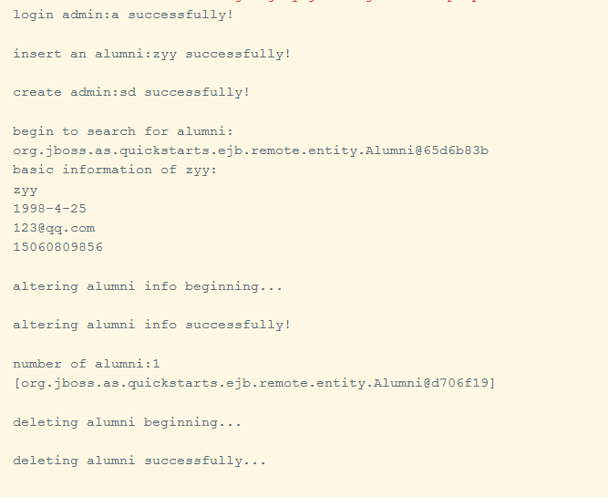

##**四、实验中遇到的问题**

1.出现如下错误

    ERROR [org.jboss.as.controller.management-operation] (Controller Boot Thread) WFLYCTL0013: Operation ("add") failed - address: ([
    ("subsystem" => "datasources"),
    ("data-source" => "budget-datasource")
    ]) - failure description: {
    "WFLYCTL0412: Required services that are not installed:" => ["jboss.jdbc-driver.mysql"],
    "WFLYCTL0180: Services with missing/unavailable dependencies" => [
    "org.wildfly.data-source.budget-datasource is missing [jboss.jdbc-driver.mysql]",
    "jboss.driver-demander.java:/budget-datasource is missing [jboss.jdbc-driver.mysql]"
    ]
    }
    
    ERROR [org.jboss.as.controller.management-operation] (Controller Boot Thread) WFLYCTL0013: Operation ("add") failed - address: ([
    ("subsystem" => "datasources"),
    ("data-source" => "budget-datasource")
    ]) - failure description: {
    "WFLYCTL0412: Required services that are not installed:" => [
    "jboss.jdbc-driver.mysql",
    "jboss.jdbc-driver.mysql"
    ],
    "WFLYCTL0180: Services with missing/unavailable dependencies" => [
    "org.wildfly.data-source.budget-datasource is missing [jboss.jdbc-driver.mysql]",
    "jboss.driver-demander.java:/budget-datasource is missing [jboss.jdbc-driver.mysql]",
    "org.wildfly.data-source.budget-datasource is missing [jboss.jdbc-driver.mysql]"
    ]
    }

解决：该错误是数据源驱动程序未配置成功导致的，确保/JBOSS_HOME/modules/main/路径下的module.xml配置是否正确且与jar包的版本是否一致。

2.部署时出现如下错误：

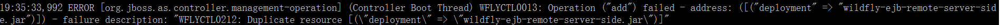

解决：将standalone最后的deployment删掉即可：

 
3.使用sql原生语言进行查询出错

解决：使用JPQL语言，调用entitymanager的createQuery方法即可：
    

    public Alumni findByName(String name) {
    String sql="SELECT p FROM Alumni p WHERE p.name=:name";
    Query query = manager.createQuery(sql).setParameter("name",name);
    Alumni alumni=(Alumni)query.getSingleResult();
    return alumni;
    }