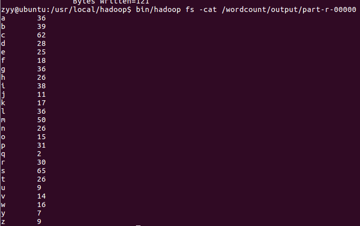

# 实验四、大文本（英文文本）首字母单词数量统计  

## 一.实验环境

Spark 2.1.0

Java JDK 1.8.0

Hadoop 2.7.1，HDFS + Map Reduce  

Linux：Ubuntu16.04

## 二.实验过程

### 1.java代码

**WordCountDriver.java:**

```
Configuration conf = new Configuration();
Job job = new Job(conf, "Word count");
job.setJarByClass(WordCountDriver.class);

//setup the MepRed
job.setMapperClass(WordCountMapper.class);
job.setReducerClass(WordCountReducer.class);

//setup the map output format
job.setMapOutputKeyClass(Text.class);
job.setMapOutputValueClass(IntWritable.class);

//setup the output format
job.setOutputKeyClass(Text.class);
job.setOutputValueClass(IntWritable.class);

//指定源文件夹和输出文件夹（关键）
FileInputFormat.setInputPaths(job, new Path("/wordcount/dataset/"));
FileOutputFormat.setOutputPath(job, new Path("/wordcount/output/"));

//exit when job finished
System.exit(job.waitForCompletion(true) ? 0 : 1);
```

**WordCountMapper.java：**

```
private static final IntWritable one = new IntWritable(1);
private Text word = new Text();
public void map(Object key, Text value, Context context)      
     throws IOException, InterruptedException{    
     String[] words = value.toString().split(" ");    
     for (String str: words) {        
       word.set(str.substring(0,1));        
       context.write(word, one);    
     }
}
```

*str.substring(0,1));*//**此处为选择str的首字母作为key**

**WordCountReducer.java:**

```
public void reduce(Text key, Iterable<IntWritable> values, Context context)        
throws IOException, InterruptedException{    
      int total = 0;    
      for(IntWritable val: values) {        
           total++;    //统计首字母出现次数
      }    
      context.write(key, new IntWritable(total));
}
```

### 2.打包jar包并放到虚拟机上：

 


### 3.执行程序：

##### 启动hadoop：


##### 将数据上传至hdfs（/wordcount/dataset下）：


##### 运行程序：

执行如下语句：

> bin/hadoop jar hadoop_mapreduce.jar

输出信息如下：

 


#### 4.查看运行结果：

###### 执行以下语句，查看/wordcount/output下的输出结果文件：

> bin/hadoop fs -cat /wordcount/output/part-r-00000



