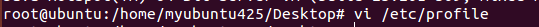
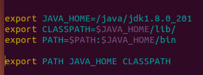
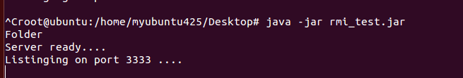
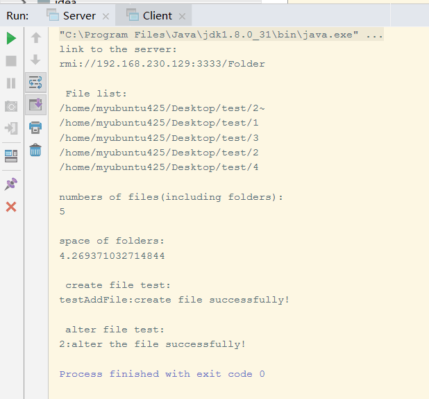
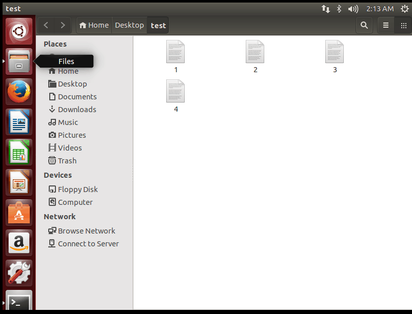
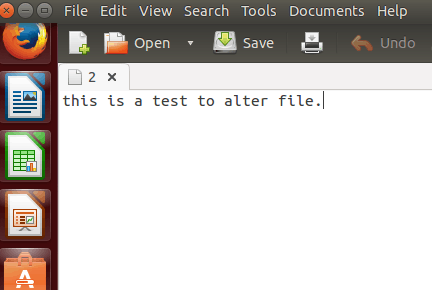
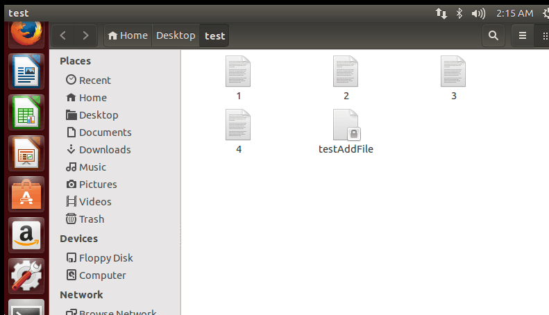
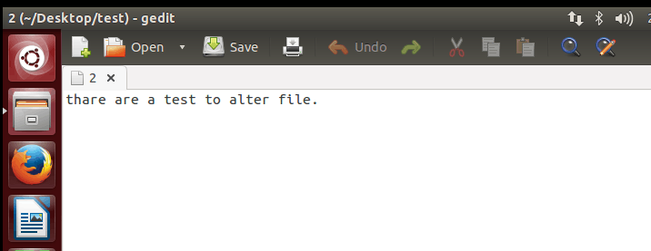

<link href="https://cdn.bootcss.com/highlight.js/9.15.5/styles/a11y-light.min.css" rel="stylesheet">

#基于RMI实现远程控制
##**一.实验目的**
通过java rmi实现对远程文件夹的控制。包括创建文本文件、修改文本文件、列出文件夹中所有文件、计算文件夹中文件的个数、文件夹所占磁盘的空间。

##**二.实验环境**
IDE：Idea Intellij

Server OS：Linux Ubuntu

Project SDK：1.8

##**三.实验过程**
###1.  源码
####接口类：Folder.java：
>     
>     public interface Folder extends java.rmi.Remote{
>     String addFile(String fileName,String fileContent) throws IOException;
>     String alterFile(String fileName, String oldstr, String newStr) throws java.rmi.RemoteException;
>     String listFile() throws java.rmi.RemoteException;
>     Integer numFile()throws java.rmi.RemoteException;
>     double spaceFile()throws java.rmi.RemoteException;   
>     }
> 

####实现类：FolderImpl.java
>     public class FolderImpl implements Folder {
>     
>     private String folderPath;
>     public FolderImpl(String path){
>     folderPath=path;
>     }
>     
>     @Override
>     public String addFile(String fileName,String fileContent) throws IOException {
>     File file=new File(folderPath+"/"+fileName);
>     if(!file.exists())
>     {
>     file.createNewFile();
>     }//创建文本文件
>     try {
>     FileOutputStream out = new FileOutputStream(folderPath + "/" + fileName);
>     PrintStream p = new PrintStream(out);
>     p.println(fileContent);
>     out.close();
>     p.close();
>     }
>     catch (FileNotFoundException e)
>     {
>     e.printStackTrace();
>     }//写入
>     return "create file successfully!";
>     }
>     
>     @Override
>     public String alterFile(String fileName, String oldstr, String newStr) throws java.rmi.RemoteException{
>     RandomAccessFile raf = null;
>     try {
>     raf = new RandomAccessFile(folderPath+"/"+fileName, "rw");
>     String line = null;
>     long lastPoint = 0; //记住上一次的偏移量
>     while ((line = raf.readLine()) != null) {
>     final long ponit = raf.getFilePointer();
>     if(line.contains(oldstr)){
>     String str=line.replace(oldstr, newStr);
>     raf.seek(lastPoint);
>     raf.writeBytes(str);
>     }
>     lastPoint = ponit;
>     }
>     } catch (Exception e) {
>     e.printStackTrace();
>     } finally {
>     try {
>     raf.close();
>     } catch (IOException e) {
>     e.printStackTrace();
>     }
>     }
>     return "alter the file successfully!";
>     }
>     
>     @Override
>     public String listFile() throws java.rmi.RemoteException{
>     File file=new File(folderPath);
>     String list=new String();
>     if(file!=null) {
>     for (File temp : file.listFiles()) {
>     list += temp.toString()+"\n";
>     
>     }
>     }
>     return list;
>     }
>     @Override
>     public Integer numFile()throws java.rmi.RemoteException{
>     File file=new File(folderPath);
>        Integer num=0;
>     for (File temp : file.listFiles()) {
>        num++;
>     }
>     return num;
>     }
>     @Override
>     public double spaceFile()throws java.rmi.RemoteException{
>     File file=new File(folderPath);
>     double userdSpace =  ((file.getTotalSpace() - file.getFreeSpace()) / 1024.0 / 1024 / 1024);
>     return userdSpace;
>     }
>     
>     
>     }
>     
>     
####服务端：Server.java
>     
>     public class  Server{
>     public Server() {}
>     public static void main(String args[]) {
>     System.setProperty("java.rmi.server.hostname", "192.168.230.129");//将当前服务器的IP指定给hostname
>     System.setProperty("java.security.policy", "/home/myubuntu425/Desktop/my.policy");//配置自定义的权限文件
>     System.setSecurityManager(new RMISecurityManager());//启动安全管理器，使用系统默认的策略文件
>     final FolderImpl obj = new FolderImpl("/home/myubuntu425/Desktop/test");
>     try {
>     Folder stub = (Folder)UnicastRemoteObject.exportObject(obj, 0);
>     // Bind the remote object's stub in the registry
>     Registry registry = LocateRegistry.createRegistry(3333);
>     registry.rebind("Folder", stub);//绑定
>     for(int i = 0; i < registry.list().length; i++)
>     System.out.println(registry.list()[i]);
>     System.err.println("Server ready....");
>     System.err.println("Listinging on port 3333 ....");
>     } catch (Exception e) {
>     e.printStackTrace();
>     }
>     }
>     }

####客户端：Client.java
>     public class Client {
>     private Client() {
>     }
>     
>     public static void main(String[] args) throws IOException, NotBoundException {
>     String host = (args.length < 1) ? "localhost" : args[0];
>     
>     String urlo = "rmi://192.168.230.129:3333/Folder";
>     Folder stub = (Folder) Naming.lookup(urlo);
>     
>      /*
>     Registry registry = LocateRegistry.getRegistry("17.16.1.59",3333, new RMIClientSocketFactory()  {
>     @Override
>     public Socket createSocket(String host, int port) throws IOException {
>     Socket socket = new Socket();
>     socket.connect(new InetSocketAddress(host, port), 2000);
>     return socket;
>     }
>     });
>     Folder stub = (Folder)registry.lookup("Folder");
>     */
>     
>     System.out.println("link to the server: \n" + urlo);
>     String str=stub.listFile();
>     System.out.println("\n File list: \n" + str);
>     
>     Integer num=stub.numFile();
>     System.out.println("numbers of files(including folders):"+"\n"+num+"\n");
>     
>     double space=stub.spaceFile();
>     System.out.println("space of folders:"+"\n"+space);
>     
>     System.out.println("\n create file test:");
>     String fileContent="test inserting content.";
>     String fileName="testAddFile";
>     String result=stub.addFile(fileName,fileContent);
>     System.out.println(fileName+":"+result);
>     
>     
>     System.out.println("\n alter file test:");
>     String fileName2="2";
>     String oldStr="is";
>     String newStr="are";
>     String result2=stub.alterFile(fileName2,oldStr,newStr);
>     System.out.println(fileName2+":"+result2);
>     }
>     }

####自定义权限文件：my.policy
>     grant codeBase "file:${user.dir}/-" {
>     permission java.net.SocketPermission  "localhost:*","accept,listen,connect,resolve";
>     permission   java.security.AllPermission "*", "read,write";
>     };

----------

###2.部署服务器
1). 将Server.java、Folder.java(接口)、FolderImpl.java(实现类)、my.policy打包为jar包

2). 将jar包部署到Linux服务器上（需下载JDK1.8并配置环境变量）

可直接从官网上下载JDK安装包：https://www.oracle.com/technetwork/java/javase/downloads/jdk8-downloads-2133151.html

配置环境变量的方法：修改/etc/profile文件

首先打开文件：

在文件末尾加入如下配置信息：(其中JAVA_HOME根据JDK下载的实际路径填写）

>     export JAVA_HOME=/java/jdk1.8.0_201   
>     export CLASSPATH=$JAVA_HOME/lib/    
>     export PATH=$PATH:$JAVA_HOME/bin	     
>     export PATH JAVA_HOME CLASSPATH	

加入以上信息后关闭文件，执行：`
> source /etc/profile`

配置完成，现在将jar包移至Linux服务器上

3)加载jar包，启动服务端Server.java

----------

###3.进行远程连接并运行客户端

在本机上运行客户端Client.java的主函数

运行结果：

对文件夹的操作结果：

运行前：

运行后：

##**四、实验可能遇到的问题**
1.在进行远程连接时，若Client调用Linux上的Server时出现拒接连接的情况，很有可能是因为Linux的/etc/hosts文件中指定的IP并不是当前服务器的真实IP，导致RMI在初始化时注册服务失败（/etc/hosts文件中默认的IP地址为127.0.0.1）。因此需要指定rmi连接主机的真实IP。

**Server.java:**

>     System.setProperty("java.rmi.server.hostname", "192.168.230.129");//将当前服务器的IP指定给hostname

**Client.java:**

>     String urlo = "rmi://192.168.230.129:3333/Folder";//客户端也必须连接相同的ip地址

2.运行jar包时出现如下情况：
>     The program 'java' can be found in the following packages:
>      * default-jre
>      * gcj-5-jre-headless
>      * openjdk-8-jre-headless
>      * gcj-4.8-jre-headless
>      * gcj-4.9-jre-headless
>      * openjdk-9-jre-headless
>     Try: sudo apt install <selected package>

这是由于JDK环境变量配置存在问题，找不到自定义的JDK路径。

解决方法如下：

1）查看/etc/profile文件下的路径是否与实际相符；

2) 执行以下语句：
> source /etc/profile`

