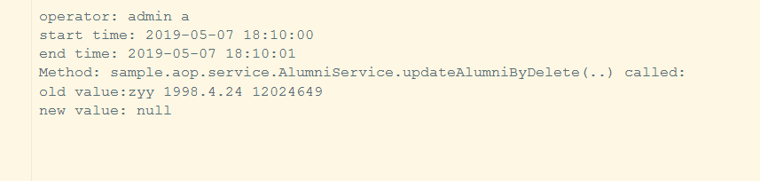

<link href="https://cdn.bootcss.com/highlight.js/9.15.5/styles/a11y-light.min.css" rel="stylesheet">

#Spring和AOP编程 
##**一.实验目的**
利用Spring技术实现【实验二】中的校友信息网站。要求采用MVC框架，同时要求加入面向切面的编程。

2.1 构建一个日志记录的切面。要求：

a. 对于所有的Alumni表的查询操作，记录各个操作的时间、用户，读取内容，存入ReadLog表格中。

b. 对于所有的Alumni表的更新（更新和删除）操作，记录各个操作的时间、用户，修改的新值和旧值，存入UpdateLog表格中（删除的新值为null）。

##**二.实验环境**
IDE：Idea Intellij

Project SDK：java jdk 1.8

spring aop+ssm框架（spring+spring mvc+mybatis）

##**三.实验过程**
###1.创建基于ssm的项目，实现对Alumni的查询和更新操作
####包结构：

####源码：
**service层：**

AlumniService.java

    package sample.aop.service;
    
    import org.apache.poi.hssf.record.crypto.Biff8DecryptingStream;
    import org.springframework.beans.factory.annotation.Autowired;
    
    import org.springframework.stereotype.Component;
    import org.springframework.stereotype.Service;
    import sample.aop.dao.AlumniMapper;
    import sample.aop.entity.Alumni;
    import sun.awt.image.PixelConverter;
    
    import java.math.BigInteger;
    import java.util.List;
    
    @Service
    public class AlumniService{
    
    	@Autowired
    	protected AlumniMapper alumniMapper;
    
    
    	public List<Alumni> findAlumniByYear (String year)
    	{
    		return alumniMapper.findAlumniByYear(year);
    	}
    
    	public Alumni findAlumniById(BigInteger id){return alumniMapper.findAlumniById(id);}
    	public  Alumni updateAlumni(Alumni alumni)
    	{
    		Alumni oldAlumni= findAlumniById(alumni.getId());
    		alumniMapper.updateAlumni(alumni);
    		return oldAlumni;
    	}
    
    
    	public Alumni updateAlumniByDelete(BigInteger id)
    	{
    		Alumni oldAlumni= findAlumniById(id);
    		alumniMapper.deleteAlumniById(id);
    		return oldAlumni;
    	}
    
    }

AdminService.java
    
    package sample.aop.service;
    
    import org.springframework.beans.factory.annotation.Autowired;
    import org.springframework.stereotype.Service;
    import sample.aop.aspect.LoggingAspect;
    import sample.aop.dao.AdminMapper;
    import sample.aop.entity.Admin;
    
    import javax.servlet.http.HttpServletRequest;
    import java.util.HashMap;
    import java.util.Map;
    
    
    @Service
    public class AdminService {
    
    @Autowired
    AdminMapper adminMapper;
    /**
     * 验证登录
     * @param username
     * @param password
    
     * @return
     */
    public Map<String, Object> loginValid(String username,String password){
    Admin admin=adminMapper.queryByUsernameAndPassword(username, password);
    Map<String, Object> map=new HashMap<>();
    if(admin==null||"".equals(admin)){
    map.put("status", "error");
    map.put("msg", "用户名或密码错误！");
    }else {
    LoggingAspect.getAdmin(admin);
    map.put("status", "ok");
       //map.put("msg", "登录成功！");
    
    }
    return map;
    }
    
    }
    

**Mapper层：**

AlumniMapper.interface

    package sample.aop.dao;
    import org.apache.ibatis.annotations.Mapper;
    import sample.aop.entity.Alumni;
    
    import java.math.BigInteger;
    import java.util.List;
    
    @Mapper
    public interface AlumniMapper {
    List<Alumni> findAlumniByYear (String year);
    Alumni findAlumniById (BigInteger id);
    void updateAlumni(Alumni alumni);
    void deleteAlumniById(BigInteger id);
    }
    
AdminMapper.interface

    package sample.aop.dao;
    
    import org.apache.ibatis.annotations.Mapper;
    import org.apache.ibatis.annotations.Param;
    import sample.aop.entity.Admin;
    
    @Mapper
    public interface AdminMapper {
    Admin  queryByUsernameAndPassword(@Param("username") String username, @Param("password")String  password);
    }

**Mapper映射文件xml：**

AlumniMapper.xml

    <?xml version="1.0" encoding="UTF-8" ?>
    <!DOCTYPE mapper PUBLIC "-//mybatis.org//DTD Mapper 3.0//EN" "http://mybatis.org/dtd/mybatis-3-mapper.dtd">
    <mapper namespace="sample.aop.dao.AlumniMapper" >
    <select id="findAlumniByYear" resultType="sample.aop.entity.Alumni"  parameterType="String" >
    select * from alumni where enrollment_year=#{year}
      </select>
    <select id="findAlumniById" resultType="sample.aop.entity.Alumni"  parameterType="BigInteger" >
    select * from alumni where id=#{id}
      </select>
    <update id="updateAlumni" parameterType="sample.aop.entity.Alumni" >
    update alumni set name=#{name},sex=#{sex},birthday=#{birthday},enrollment_year=#{year},work_area=#{work_area},work_address=#{work_address},position=#{position},
    phone=#{phone},email=#{email},weixin=#{weixin}  where id=#{id}
     </update>
    <delete id="deleteAlumniById" parameterType="BigInteger">
    delete  from  alumni where id=#{id}
    </delete>
    </mapper>

AdminMapper.xml

    <?xml version="1.0" encoding="UTF-8" ?>
    <!DOCTYPE mapper PUBLIC "-//mybatis.org//DTD Mapper 3.0//EN" "http://mybatis.org/dtd/mybatis-3-mapper.dtd">
    <mapper namespace="sample.aop.dao.AdminMapper" >
    <select id="queryByUsernameAndPassword" resultType="sample.aop.entity.Admin"  parameterType="String" >
    select * from admin where account=#{username} and password=#{password}
      </select>
    </mapper>

**配置文件 spring-mybatis.xml：**

    <?xml version="1.0" encoding="UTF-8"?>
    <beans xmlns="http://www.springframework.org/schema/beans"
       xmlns:xsi="http://www.w3.org/2001/XMLSchema-instance" xmlns:p="http://www.springframework.org/schema/p"
       xmlns:context="http://www.springframework.org/schema/context"
       xmlns:mvc="http://www.springframework.org/schema/mvc" xmlns:tx="http://www.springframework.org/schema/tx"
       xmlns:aop="http://www.springframework.org/schema/aop"
       xsi:schemaLocation="http://www.springframework.org/schema/beans
    http://www.springframework.org/schema/beans/spring-beans-3.1.xsd
    http://www.springframework.org/schema/context
    http://www.springframework.org/schema/context/spring-context-3.1.xsd
    http://www.springframework.org/schema/mvc
    http://www.springframework.org/schema/mvc/spring-mvc-4.0.xsd http://www.springframework.org/schema/tx http://www.springframework.org/schema/tx/spring-tx.xsd http://www.springframework.org/schema/aop http://www.springframework.org/schema/aop/spring-aop.xsd">
    
    
    
    <!-- spring和MyBatis完美整合，不需要mybatis的配置映射文件 -->
    
    <aop:aspectj-autoproxy proxy-target-class="true" expose-proxy="true"/>
    <bean id="dataSource"
      class="org.apache.commons.dbcp.BasicDataSource">
    <property name="driverClassName"
      value="com.mysql.cj.jdbc.Driver">
    </property>
    <property name="url"
      value="jdbc:mysql://localhost:3306/aop_sample?serverTimezone=GMT">
    </property>
    <property name="username" value="root"></property>
    <property name="password" value="tiger"></property>
    </bean>
    
    
    <bean class="org.mybatis.spring.mapper.MapperScannerConfigurer">
    <property name="basePackage" value="sample.aop.dao"/>
    <property name="sqlSessionFactoryBeanName" value="sqlSessionFactoryBean"/>
    </bean>
    
    <!--
    <context:component-scan base-package="sample.aop" />
    -->
    <bean id="sqlSessionTemplate" class="org.mybatis.spring.SqlSessionTemplate">
    <constructor-arg ref="sqlSessionFactoryBean"/>
    </bean>
    
    <bean id="transactionManager" class="org.springframework.jdbc.datasource.DataSourceTransactionManager">
    <property name="dataSource" ref="dataSource"/>
    </bean>
    <bean id="sqlSessionFactoryBean" class="org.mybatis.spring.SqlSessionFactoryBean">
    <property name="dataSource" ref="dataSource"/>
    <property name="mapperLocations" value="classpath:/mapping/*.xml"/>
    </bean>
    
    <tx:advice id="txAdvice" transaction-manager="transactionManager">
    <tx:attributes>
    <tx:method name="find*" read-only="true" />
    <tx:method name="select*" read-only="true"/>
    <tx:method name="get*" read-only="true"/>
    <tx:method name="submit*" propagation="REQUIRED"/>
    <tx:method name="clear*" propagation="REQUIRED"/>
    <tx:method name="create*" propagation="REQUIRED"/>
    <tx:method name="activate*" propagation="REQUIRED"/>
    <tx:method name="save*" propagation="REQUIRED"/>
    <tx:method name="insert*" propagation="REQUIRED"/>
    <tx:method name="add*" propagation="REQUIRED"/>
    <tx:method name="update*" propagation="REQUIRED"/>
    <tx:method name="delete*" propagation="REQUIRED"/>
    <tx:method name="remove*" propagation="REQUIRED"/>
    <tx:method name="execute*" propagation="REQUIRED"/>
    <tx:method name="del*" propagation="REQUIRED"/>
    </tx:attributes>
    </tx:advice>

    </beans>

**pom.xml：（需要引入aop、mybatis、junit、spring等相关jar包）**

    <?xml version="1.0" encoding="UTF-8"?>
    <project xmlns="http://maven.apache.org/POM/4.0.0" xmlns:xsi="http://www.w3.org/2001/XMLSchema-instance"
    	xsi:schemaLocation="http://maven.apache.org/POM/4.0.0 https://maven.apache.org/xsd/maven-4.0.0.xsd">
    	<modelVersion>4.0.0</modelVersion>
    
    <groupId>org.springframework.boot</groupId>
    <version>1.0</version>
    	<artifactId>spring-boot-sample-aop</artifactId>
    	<name>Spring Boot AOP Sample</name>
    	<description>Spring Boot AOP Sample</description>
    
    	<parent>
    		<groupId>org.springframework.boot</groupId>
    		<artifactId>spring-boot-starter-parent</artifactId>
    		<version>2.1.0.RELEASE</version>
    		<relativePath/> <!-- lookup parent from repository -->
    	</parent>
    
    	<properties>
    		<main.basedir>${basedir}/../..</main.basedir>
    	</properties>
    
    
    	<dependencies>
    		<!-- Compile -->
    		<dependency>
    			<groupId>org.springframework.boot</groupId>
    			<artifactId>spring-boot-starter-aop</artifactId>
    		</dependency>
    		<!-- Test -->
    		<dependency>
    			<groupId>org.springframework.boot</groupId>
    			<artifactId>spring-boot-starter-test</artifactId>
    			<scope>test</scope>
    		</dependency>
    
    		<dependency>
    			<groupId>org.springframework.boot</groupId>
    			<artifactId>spring-boot</artifactId>
    			<version>2.1.0.RELEASE</version>
    		</dependency>
    		<dependency>
    			<groupId>org.springframework.boot</groupId>
    			<artifactId>spring-boot-autoconfigure</artifactId>
    			<version>2.1.0.RELEASE</version>
    		</dependency>
    
    
    		<dependency>
    			<groupId>org.aspectj</groupId>
    			<artifactId>aspectjweaver</artifactId>
    			<version>1.8.5</version>
    		</dependency>
    		<dependency>
    			<groupId>redis.clients</groupId>
    			<artifactId>jedis</artifactId>
    			<version>2.9.0</version>
    		</dependency>
    <dependency>
    <groupId>org.assertj</groupId>
    <artifactId>assertj-core</artifactId>
    <version>3.5.2</version>
    </dependency>
    		<dependency>
    			<groupId>org.apache.poi</groupId>
    			<artifactId>poi</artifactId>
    			<version>3.9</version>
    		</dependency>
    		<dependency>
    		<groupId>org.apache.poi</groupId>
    		<artifactId>poi-scratchpad</artifactId>
    		<version>3.9</version>
    
    	</dependency>
    
    		<dependency>
    			<groupId>org.springframework</groupId>
    			<artifactId>spring-beans</artifactId>
    			<version>5.1.2.RELEASE</version>
    		</dependency>
    <dependency>
    <groupId>org.springframework</groupId>
    <artifactId>spring-core</artifactId>
    <version>5.1.5.RELEASE</version>
    </dependency>
    		<dependency>
    			<groupId>org.aspectj</groupId>
    			<artifactId>aspectjrt</artifactId>
    			<version>1.8.5</version>
    		</dependency>
    <dependency>
    <groupId>junit</groupId>
    <artifactId>junit</artifactId>
    <version>4.13-beta-2</version>
    <scope>test</scope>
    </dependency>
    <dependency>
    <groupId>org.springframework.boot</groupId>
    <artifactId>spring-boot-test</artifactId>
    <version>2.1.0.RELEASE</version>
    <scope>test</scope>
    </dependency>
    		<dependency>
    			<groupId>org.springframework.boot</groupId>
    			<artifactId>spring-boot-starter-jdbc</artifactId>
    		</dependency>
    		<dependency>
    			<groupId>commons-dbcp</groupId>
    			<artifactId>commons-dbcp</artifactId>
    			<version>1.4</version>
    		</dependency>
    		<dependency>
    			<groupId>commons-pool</groupId>
    			<artifactId>commons-pool</artifactId>
    			<version>1.5.4</version>
    		</dependency>
    		<dependency>
    			<groupId>mysql</groupId>
    			<artifactId>mysql-connector-java</artifactId>
    
    		</dependency>
    		<dependency>
    			<groupId>org.mybatis</groupId>
    			<artifactId>mybatis-spring</artifactId>
    			<version>1.3.2</version>
    		</dependency>
    		<dependency>
    			<groupId>org.mybatis.spring.boot</groupId>
    			<artifactId>mybatis-spring-boot-starter</artifactId>
    			<version>1.3.2</version>
    		</dependency>
    		<dependency>
    			<groupId>org.mybatis.spring.boot</groupId>
    			<artifactId>mybatis-spring-boot-autoconfigure</artifactId>
    			<version>1.3.2</version>
    		</dependency>
    		<dependency>
    			<groupId>org.apache.poi</groupId>
    			<artifactId>poi-ooxml</artifactId>
    			<version>3.9</version>
    		</dependency>
    		<dependency>
    			<groupId>log4j</groupId>
    			<artifactId>log4j</artifactId>
    			<version>1.2.17</version>
    		</dependency>
    		
    
    		<dependency>
    			<groupId>org.springframework.boot</groupId>
    			<artifactId>spring-boot-starter-web</artifactId>
    		</dependency>
    
    	</dependencies>
    	<build>
    		<plugins>
    			<plugin>
    				<groupId>org.springframework.boot</groupId>
    				<artifactId>spring-boot-maven-plugin</artifactId>
    			</plugin>
    
    
    			<plugin>
    <groupId>org.apache.maven.plugins</groupId>
    <artifactId>maven-compiler-plugin</artifactId>
    <configuration>
    <source>7</source>
    <target>7</target>
    </configuration>
    </plugin>
    
    </plugins>
    		<resources>
    			<resource>
    				<directory>src/main/java</directory>
    				<includes>
    					<include>**/*.xml</include>
    				</includes>
    			</resource>
    		</resources>
    
    
    
    	</build>
    
    </project>
    

###2.配置日志文件，构建aop切面

log4j.properties:

    log4j.logger.ReadLog=DEBUG,file
    
    !--log4j.appender.stdout=org.apache.log4j.ConsoleAppender
    !--log4j.appender.stdout.layout=org.apache.log4j.PatternLayout
    !--log4j.appender.stdout.layout.ConversionPattern=%d %p [%c] - %m%n
    !--log4j.appender.stdout.encoding=utf-8
    
    
    log4j.appender.file.Encoding=UTF-8
    log4j.appender.file=org.apache.log4j.FileAppender
    log4j.appender.file.File=${user.dir}/src/ReadLog.log
    log4j.appender.file.Threshold=DEBUG
    log4j.appender.file.layout=org.apache.log4j.PatternLayout
    log4j.appender.file.append = true
    
    
    log4j.logger.UpdateLog=DEBUG,file2
    
    log4j.appender.file2.Encoding=UTF-8
    log4j.appender.file2=org.apache.log4j.FileAppender
    log4j.appender.file2.File=${user.dir}/src/UpdateLog.log
    log4j.appender.file2.Threshold=DEBUG
    log4j.appender.file2.layout=org.apache.log4j.PatternLayout
    log4j.appender.file2.append = true
    
    
    log4j.logger.LoginLog=DEBUG,file3
    
    log4j.appender.file3.Encoding=UTF-8
    log4j.appender.file3=org.apache.log4j.FileAppender
    log4j.appender.file3.File=${user.dir}/src/LoginLog.log
    log4j.appender.file3.Threshold=DEBUG
    log4j.appender.file3.layout=org.apache.log4j.PatternLayout
    log4j.appender.file3.append = true
    

LoggingAspect.java:

    package sample.aop.aspect;
    import org.apache.log4j.Logger;
    import org.apache.log4j.PropertyConfigurator;
    import org.aspectj.lang.JoinPoint;
    
    import org.aspectj.lang.annotation.*;
    import org.springframework.beans.factory.annotation.Autowired;
    import org.springframework.stereotype.Component;
    import sample.aop.entity.Admin;
    import sample.aop.entity.Alumni;
    import sample.aop.service.AlumniService;
    
    import javax.servlet.http.HttpServletRequest;
    import java.text.SimpleDateFormat;
    import java.util.Arrays;
    import java.util.List;
    import java.util.Map;
    
    
    @Aspect
    @Component
    public class LoggingAspect {
    
    public String account="";//用户名
    public static Admin a =new Admin();//记录登录的管理员
    private long startTimeMillis = 0; // 开始时间
    private long endTimeMillis = 0; // 结束时间
    @Autowired
    private AlumniService alumniService;
    
       // private HttpServletRequest request = null;
    
    /**
     *
     * @Description: 查询方法调用前触发   记录开始时间
     * @author zyy
     * @date 2019.4.30
     * @param joinPoint
     */
    @Before("execution(* sample.aop.service.AlumniService.findAlumniByYear(..))")
    public void beforeSearch(JoinPoint joinPoint){
    System.out.println("before");
       // request = ((ServletRequestAttributes) RequestContextHolder.getRequestAttributes()).getRequest();
       // admin = (Admin)request.getSession().getAttribute("current_user");
    startTimeMillis = System.currentTimeMillis(); //记录方法开始执行的时间
    String startTime = new SimpleDateFormat("yyyy-MM-dd HH:mm:ss").format(startTimeMillis);  //格式化开始时间
    Logger.getLogger("ReadLog").info("\noperator: admin "+a.getAccount());
    Logger.getLogger("ReadLog").info("start time: "+startTime );
    }
    
    /**
     *
     * @Description: 查询方法调用后触发   记录结束时间
     * @author zyy
     * @param joinPoint
     */
    @After("execution(* sample.aop.service.AlumniService.findAlumniByYear(..))")
    public  void afterSearch(JoinPoint joinPoint) {
    System.out.println("after");
    endTimeMillis = System.currentTimeMillis();
    
    //格式化结束时间
    String endTime = new SimpleDateFormat("yyyy-MM-dd HH:mm:ss").format(endTimeMillis);
    
    
    //PropertyConfigurator.configure("src/log4j.properties");
    
    Logger.getLogger("ReadLog").info(/*" admin: "+admin.getAccount()+*/"end time: "+endTime);
    
    }
    
    
    @AfterReturning(pointcut="execution(* sample.aop.service.AlumniService.findAlumniByYear(..))", returning="retVal")
    public void logAfterReturningGetAlumni(Object retVal) throws Throwable
    {
    Logger.getLogger("ReadLog").info("Method: sample.aop.service.AlumniService.findAlumniByYear(..) called:\nsearch result:");
    List<Alumni>alumniList=(List<Alumni>)retVal;
    for(int i=0;i<alumniList.size();i++)
    {
    Logger.getLogger("ReadLog").info(alumniList.get(i).getName());
    }
    }
    
    
    
    
    
    /**
     *
     * @Description: 更新方法调用前触发   记录开始时间
     * @author zyy
     * @date 2019.4.30
     * @param joinPoint
     */
    @Before("execution(* sample.aop.service.AlumniService.updateAlumni*(..))")
    public void beforeUpdate(JoinPoint joinPoint){
    System.out.println("before");
    // request = ((ServletRequestAttributes) RequestContextHolder.getRequestAttributes()).getRequest();
    // admin = (Admin)request.getSession().getAttribute("current_user");
    startTimeMillis = System.currentTimeMillis(); //记录方法开始执行的时间
    String startTime = new SimpleDateFormat("yyyy-MM-dd HH:mm:ss").format(startTimeMillis);  //格式化开始时间
    
    Logger.getLogger("UpdateLog").info("\noperator: admin "+a.getAccount());
    Logger.getLogger("UpdateLog").info("start time: "+startTime );
    }
    
    /**
     *
     * @Description: 更新方法调用后触发   记录结束时间
     * @author zyy
     * @param joinPoint
     */
    @After("execution(* sample.aop.service.AlumniService.updateAlumni*(..))")
    public  void afterUpdate(JoinPoint joinPoint) {
    System.out.println("after");
    endTimeMillis = System.currentTimeMillis();
    
    //格式化结束时间
    String endTime = new SimpleDateFormat("yyyy-MM-dd HH:mm:ss").format(endTimeMillis);
    
    
    //PropertyConfigurator.configure("src/log4j.properties");
    
    Logger.getLogger("UpdateLog").info(/*" admin: "+admin.getAccount()+*/"end time: "+endTime);
    
    }
    
    
    /**
     * 记录更新的旧值和新值
     * @param joinPoint
     * @param retVal  返回值
     * @throws Throwable
     */
    @AfterReturning(pointcut="execution(* sample.aop.service.AlumniService.updateAlumni(..))", returning="retVal")
    public void logAfterReturningUpdateAlumni(JoinPoint joinPoint,Object retVal) throws Throwable
    {
    Alumni oldAlumni=(Alumni)retVal;
    
   
    Logger.getLogger("UpdateLog").info("Method: sample.aop.service.AlumniService.updateAlumni(..) called:\nold value:"+oldAlumni.getName()+" "+oldAlumni.getBirthday() +" "+oldAlumni.getPhone());
    Object[] object=joinPoint.getArgs();
    Alumni newAlumni=new Alumni();
       for(int i=0;i<object.length;i++)
       {
       newAlumni=(Alumni)object[i];
       }
    Logger.getLogger("UpdateLog").info("new value:"+ newAlumni.getName()+" "+newAlumni.getBirthday()+" "+newAlumni.getPhone());
    
    
    }
    
    
    
    /**
     * 记录删除的旧值和新值
     * @param joinPoint
     * @param retVal  返回值
     * @throws Throwable
     */
    @AfterReturning(pointcut="execution(* sample.aop.service.AlumniService.updateAlumniByDelete(..))", returning="retVal")
    public void logAfterReturningDeleteAlumni(JoinPoint joinPoint,Object retVal) throws Throwable
    {
    Alumni oldAlumni=(Alumni)retVal;
    
    
    Logger.getLogger("UpdateLog").info("Method: sample.aop.service.AlumniService.updateAlumniByDelete(..) called:\nold value:"+oldAlumni.getName()+" "+oldAlumni.getBirthday() +" "+oldAlumni.getPhone());
    
    Logger.getLogger("UpdateLog").info("new value: null");
    
    
    }
    /**
     * 获取用户登录成功传过来的user值
     * @param admin
     * @return
     */
    public static Admin getAdmin(Admin admin){
    a=admin;
    return a;
    }
    
    
    /**
     * 管理员登录方法的切入点
     */
    @AfterReturning(pointcut="execution(* sample.aop.service.AdminService.loginValid(..))", argNames = "joinPoint,object", returning = "object")
    public void loginLog(JoinPoint joinPoint, Object object) throws Throwable {
    @SuppressWarnings("unchecked")
    //获取service登录执行后的参数  这里返回map
    Map<String, Object> map=(Map<String, Object>) object;
    System.out.println(map);
    if (map.get("status")=="error") {
    Logger.getLogger("LoginLog").info("Login error!");
    }
    if (joinPoint.getArgs() == null) {// 没有参数
    Logger.getLogger("LoginLog").info("Login error!");
    }
    account=a.getAccount();
    startTimeMillis = System.currentTimeMillis(); //记录方法开始执行的时间
    String startTime = new SimpleDateFormat("yyyy-MM-dd HH:mm:ss").format(startTimeMillis);  //格式化开始时间
    
    Logger.getLogger("LoginLog").info("\nLogin admin:"+account+" success!");
    Logger.getLogger("LoginLog").info("Login time: "+startTime );
    }
    
    }
    

###3.测试文件

    package sample.aop;
    
    import org.junit.Test;
    import org.junit.runner.RunWith;
    
    import org.springframework.beans.factory.annotation.Autowired;
    import org.springframework.boot.test.context.SpringBootTest;
    
    import org.springframework.test.context.junit4.SpringJUnit4ClassRunner;
    
    import sample.aop.entity.Alumni;
    import sample.aop.service.AdminService;
    import sample.aop.service.AlumniService;
    
    import javax.servlet.*;
    import javax.servlet.http.*;
    import java.io.BufferedReader;
    import java.io.IOException;
    import java.io.UnsupportedEncodingException;
    import java.math.BigInteger;
    import java.security.Principal;
    import java.util.*;
    
    
    @RunWith(SpringJUnit4ClassRunner.class)
    @SpringBootTest
    public class testMain {
    
    @Autowired
    private AlumniService alumniService;
    @Autowired
    private AdminService adminService;
    
    @Test
    public  void testFind () {
    
    adminService.loginValid("a","a");
    String year="2016";
       List<Alumni>alumniList=new ArrayList<Alumni>();
       alumniList=alumniService.findAlumniByYear(year);
       for(int i=0;i<alumniList.size();i++)
       {
       System.out.println(alumniList.get(i).getName());
       }
    
    }
    
    @Test
    public void testUpdateAlumni()
    {
    adminService.loginValid("a","a");
    BigInteger bi=new BigInteger("1");
    Alumni alumni=new Alumni(bi,"zyy",2,"1998.4.24","2016","ggg","sad","qqw","12024649","45648@qq.com","faf");
    Alumni oldAlumni=alumniService.updateAlumni(alumni);
    }
    
       @Test
    public void testDeleteAlumni()
    {
    adminService.loginValid("a","a");
    BigInteger id=new BigInteger("1");
      alumniService.updateAlumniByDelete(id);
      }
    
    }

##**四.实验结果**
###1.生成日志文件
**管理员登录：**

**查询校友：**
    
  
   
**更新校友信息：**
   

**删除校友：**

      

##**五、实验中遇到的问题及解决方案**

###1.搭建ssm框架时，无法注入bean
解决方法：在启动类中，添加如下语句：

    @ComponentScan(value = {"sample.aop"})
引号中的内容为项目目录，该语句会自动扫描目录下所有包里的所有文件，因此需要在每一个类下添加相应的注解（@Mapper/@Service）

###2.搭建ssm框架时，mapper层的文件找不到其映射的xml文件
解决方法：需要在配置文件中加入如下语句：

    <bean id="sqlSessionFactoryBean" class="org.mybatis.spring.SqlSessionFactoryBean">
    <property name="dataSource" ref="dataSource"/>
    <property name="mapperLocations" value="classpath:/mapping/*.xml"/>
    </bean>
其中classpath的值为xml文件的存放位置。
另外，如果项目中的xml没有被编译到target文件夹，就需要在pom.xml文件下添加如下内容：

     <resources>
			<resource>
				<directory>src/main/java</directory>
				<includes>
					<include>**/*.xml</include>
				</includes>
			</resource>
		</resources>

###3.mybatis异常：Could not find result map
    错误写法：
    <select id="queryXXXCount" resultMap="java.util.Map" >
    正确写法:
    <select id="queryXXXCount" resultType="java.util.Map">
    
###4.日志文件配置失败（即不能生成日志记录）或"log4j:WARN No appenders could be found for logger"

错误写法：
private static Log logger = LogFactory.getLog(Dom4j.class);
logger.info();
日志仍会输出至info.log

正确写法：
Logger.getLogger("UpdateLog").info("succeed: " + message);

###5.在aop切点获取方法返回值或参数

解决方法：使用@AfterReturning注解（即在方法返回值后触发）

获取返回值： 

@AfterReturning(pointcut="execution(* sample.aop.service.AlumniService.updateAlumni(..))", returning="retVal")

public void logAfterReturningUpdateAlumni(JoinPoint joinPoint,Object retVal)

Alumni oldAlumni=(Alumni)retVal;

获取方法的参数：

public void logAfterReturningUpdateAlumni(JoinPoint joinPoint,Object retVal)

Object[] object=joinPoint.getArgs();
    
    
    

    
    